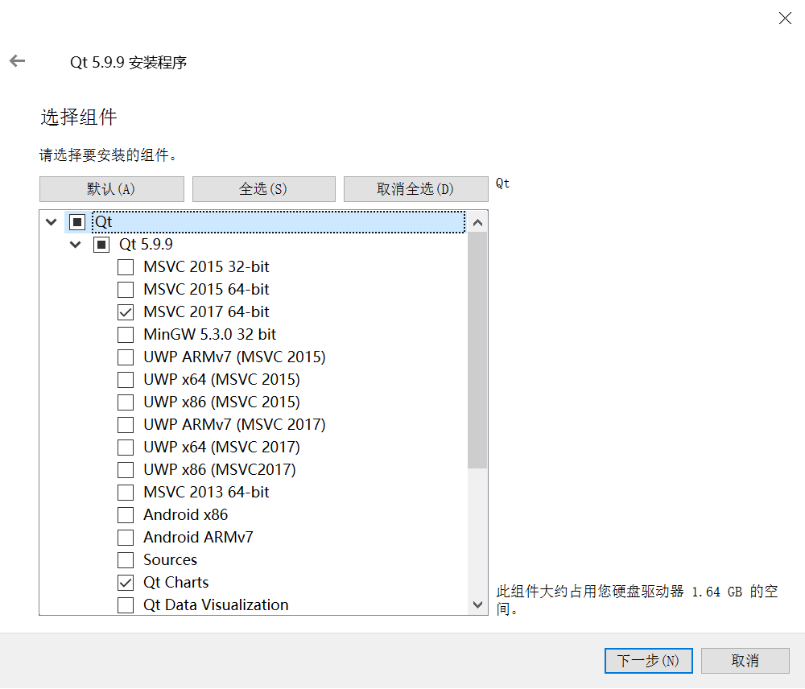
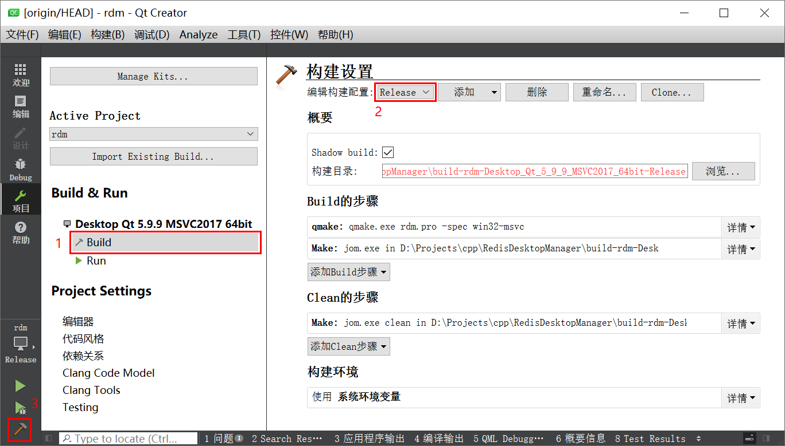

## 背景说明
Redis Desktop Manager 非常好用，但是从官网下载需要收费，好在官方有提供源码可以自行编译，特此记录一下。

> 官网：[https://redisdesktop.com/](https://redisdesktop.com/)
>
> GitHub：[https://github.com/uglide/RedisDesktopManager/](https://github.com/uglide/RedisDesktopManager/)

官方给出的编译步骤如下：

> **Build on Windows**
>
> 1. Install [Visual Studio 2017 Community Edition](https://docs.microsoft.com/en-us/visualstudio/releasenotes/vs2017-relnotes).
> 2. Install [Qt 5.9](https://www.qt.io/download).
> 3. Go to `3rdparty/qredisclient/3rdparty/hiredis` and apply the patch to fix compilation on Windows: `git apply ../hiredis-win.patch`
> 4. Go to the `3rdparty/` folder and install zlib with `nuget`: `nuget install zlib-msvc14-x64 -Version 1.2.11.7795`
> 5. Install Python 3.7 amd64 to `C:\Python37-x64`.
> 6. Install Python requirements `pip3 install -r src/py/requirements.txt`.
> 7. Open `./src/rdm.pro` in **Qt Creator**. Choose the `Desktop Qt 5.9.x MSVC2017 64bit > Release` build profile.
> 8. Run build. (Just hit `Ctrl-B`)


## 相关软件

1. [Visual Studio 2017 Community Edition](https://visualstudio.microsoft.com/zh-hans/vs/older-downloads/)
2. [Qt 5.9](http://download.qt.io/archive/qt/5.9/) 【文中使用的是 qt-opensource-windows-x86-5.9.9 （文件大小为 2.39G）】
3. [NuGet](https://www.nuget.org/downloads) 【文中使用的是 nuget.exe v5.4.0】
4. [Python 3.7](https://www.python.org/downloads/) 【文中使用的是 python-3.7.7-amd64】
5. [NSIS](http://nsis.sourceforge.net/Download) 【文中使用的是 nsis-3.05】


软件安装部分不再赘述，文中软件大部分安装在 `D:\Tools` 目录下。需要注意安装 Qt 时候需要包含以下组件：




## 编译步骤

### 步骤1 代码检出

```powershell
git clone --recursive https://github.com/uglide/RedisDesktopManager.git -b 2019

# 子模块下载失败时可使用一下命令重试
git submodule update --init --recursive
```

### 步骤2 修改 hiredis

Windows 平台上需要打补丁才能编译成功，执行一下以下命令。

```powershell
# 当前位置为 RedisDesktopManager
cd 3rdparty\qredisclient\3rdparty\hiredis
git apply ..\hiredis-win.patch
```

### 步骤3 安装 zlib

```powershell
# 当前位置为 RedisDesktopManager
cd 3rdparty
nuget install zlib-msvc14-x64 -Version 1.2.11.7795
```

### 步骤4 修改 Python 3.7 配置路径

官方说明是需要将 Python 3.7 安装到 `C:\Python37-x64`，如果安装到其他路径改一下配置文件即可。

```
# 编辑 3rdparty\pyotherside.pri
# 将 C:\Python37-x64 修改为 Python3.7 的安装路径

QMAKE_LIBS += -LC:\Python37-x64\libs -lpython37
INCLUDEPATH += C:\Python37-x64\include\
```

### 步骤5 安装 Python requirements

```powershell
# 当前位置为 RedisDesktopManager
pip3 install -r src\py\requirements.txt
```

### 步骤6 编译主程序

使用 **Qt Creator** 打开 `.\src\rdm.pro` 文件，选择 `Desktop Qt 5.9.x MSVC2017 64bit > Release` 构建配置，然后进行编译。

> 编译生成的主程序保存在 `.\bin\windows\release` 目录。



### 步骤7 打包依赖

编译生成的主程序需要添加依赖文件才能正常运行。

```powershell
# 当前位置为 RedisDesktopManager
cp -y .\bin\windows\release\rdm.exe .\build\windows\installer\resources\rdm.exe

cd .\build\windows\installer\resources
# 优先选择这个
D:\Tools\Qt\Qt5.9.9\5.9.9\msvc2017_64\bin\windeployqt --no-angle --no-opengl-sw --no-compiler-runtime --no-translations --release --force --qmldir D:\Projects\cpp\rdm\src\qml rdm.exe

# 删除多余的文件
rmdir /S /Q .\platforminputcontexts
rmdir /S /Q .\qmltooling
rmdir /S /Q .\QtGraphicalEffects
del /Q  .\imageformats\qtiff.dll
del /Q  .\imageformats\qwebp.dll
```

下载 Python 的运行环境（[python-3.7.7-embed-amd64.zip](https://www.python.org/ftp/python/3.7.7/python-3.7.7-embed-amd64.zip)），并将  `python37.zip`、`python37.dll` 两个文件复制到 `\build\windows\installer\resources` 目录下。

### 步骤8 生成 pyc 文件

将 `%Python37%\Lib` 和 ` src\py`目录，将以下文件复制到 `.\build\windows\installer\resources`，目录架构如下：

```
Lib
└─site-packages
 ├─cbor
 ├─formatters
 ├─msgpack
 ├─rdb
 ├─rdbtools
 │  ├─cli
 │  └─templates
 ├─redis
 ├─bitstring.py
 ├─lzf.cp37-win_amd64.pyd
 └─phpserialize.py
```

```powershell
# 当前位置为 RedisDesktopManager\build\windows\installer\resources
mkdir Lib
cp -r D:\Projects\cpp\RedisDesktopManager\src\py .\Lib\site-packages
cp -r D:\Tools\Python\Python37\Lib\site-packages\cbor .\Lib\site-packages\cbor
cp -r D:\Tools\Python\Python37\Lib\site-packages\msgpack .\Lib\site-packages\msgpack
cp -r D:\Tools\Python\Python37\Lib\site-packages\rdbtools .\Lib\site-packages\rdbtools
cp -r D:\Tools\Python\Python37\Lib\site-packages\redis .\Lib\site-packages\redis
cp D:\Tools\Python\Python37\Lib\site-packages\bitstring.py .\Lib\site-packages
cp D:\Tools\Python\Python37\Lib\site-packages\lzf.cp37-win_amd64.pyd .\Lib\site-packages
cp D:\Tools\Python\Python37\Lib\site-packages\phpserialize.py .\Lib\site-packages

cd Lib/site-packages/
# 编译 pyc
python -m compileall -b .
```

编译完后删除 `site-packages` 下的所有  `__pycache__`  目录和 `*.py` 文件，这里为了方便删除使用 `Cmder`   中的 `bash` 来执行删除。

```shell
# bash
find . -name "__pycache__" -exec rm -rf {} \;
find . -name "*.py" -delete
```

### 步骤9 制作安装程序

```powershell
# 当前位置为 RedisDesktopManager
call "D:\\Tools\\NSIS\\makensis.exe" /V1 /DVERSION=2019.5.0 ./build/windows/installer/installer.nsi
```

> 制作好的安装程序在 `RedisDesktopManager\build\windows\installer` 目录下。


## 参考资料

[官网教程](http://docs.redisdesktop.com/en/latest/install/#build-from-source)

[源码编译Redis Desktop Manager](https://kany.me/2019/10/10/compile-redis-desktop-manager/)
